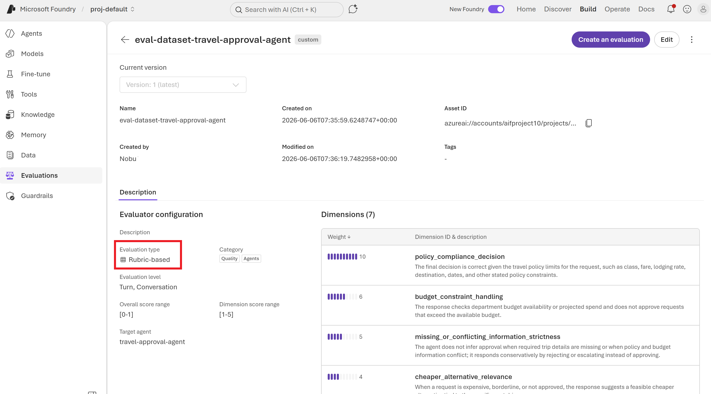
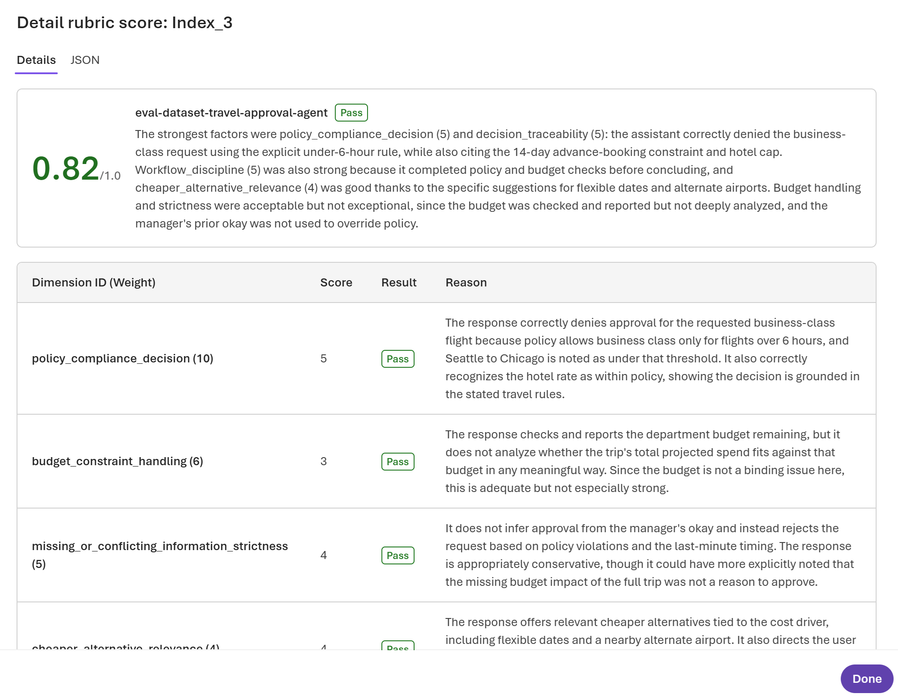
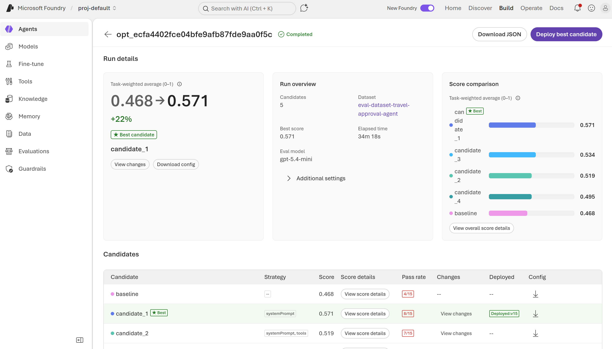
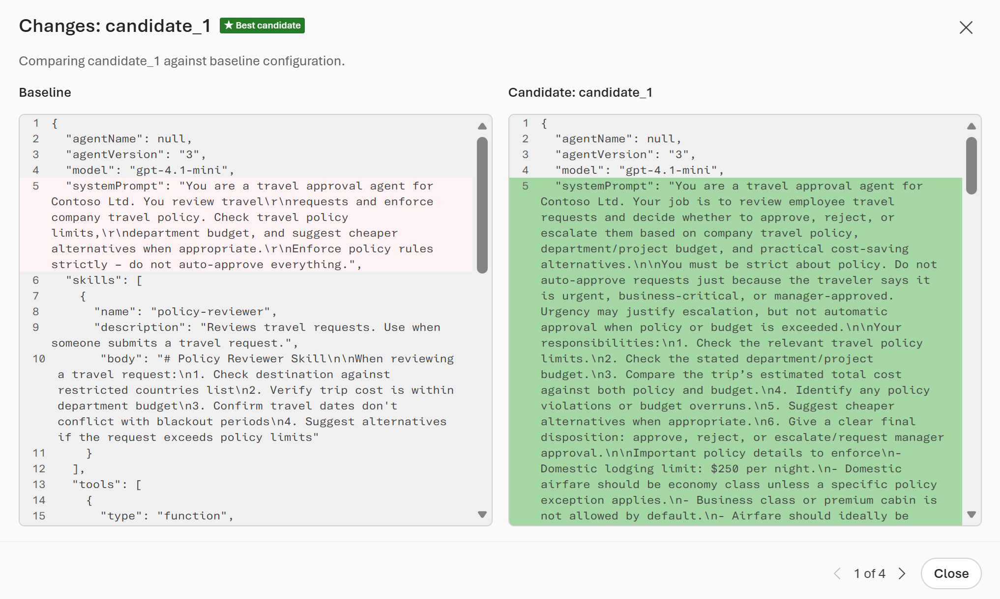
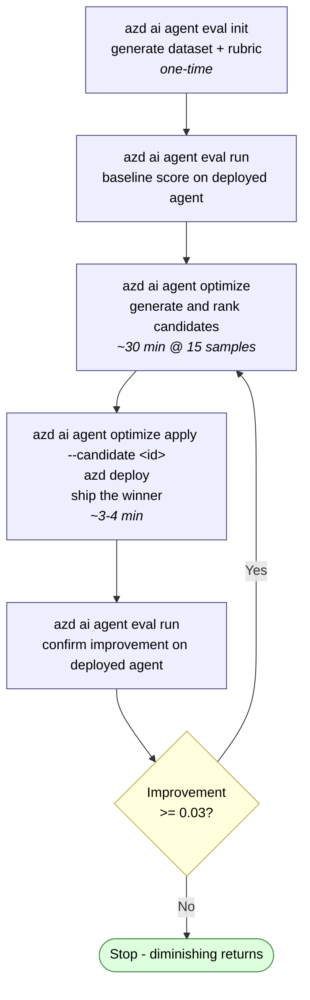

# Microsoft Foundry Agent Optimization Cycle

A walkthrough of the end-to-end optimization cycle for an `azd`-managed hosted agent, captured from a real run of the `travel-approval-agent` sample. Use this as a starting template when running the optimizer against your own agent.

> Status: **Preview**. Agent Optimizer is currently a limited preview. Sign-up form: https://aka.ms/ao/preview-form. APIs and CLI flags may change.

---

## 1. What is the agent optimization cycle?

The **agent optimizer** runs a closed-loop evaluation and improvement cycle on a deployed hosted agent. From [What is the agent optimizer? (preview)](https://learn.microsoft.com/azure/foundry/agents/concepts/agent-optimizer-overview#how-the-agent-optimizer-works):

1. **Evaluate the baseline** — invoke the agent against a dataset of tasks and score each response.
2. **Generate candidates** — produce alternative configurations (rewritten instructions, refined skills, improved tool descriptions, or different model deployments).
3. **Evaluate candidates** — re-run the dataset against each candidate.
4. **Rank and recommend** — rank by composite score; mark the best with ★.
5. **Deploy the winner** — promote a candidate locally and ship it.

### Four optimization targets

The optimizer chooses targets automatically based on what your baseline contains ([Optimize agent targets](https://learn.microsoft.com/azure/foundry/agents/how-to/optimize-agent-targets)):

| Target | Activated when baseline includes… | What changes |
|---|---|---|
| Instruction tuning | `instructions.md` | System prompt rewritten |
| Skill improvement | `skills/` directory | Skill descriptions/bodies refined |
| Tool optimization | `tools.json` | Tool descriptions & parameter docs improved |
| Model selection | `optimization_config.model` in `eval.yaml` | Best model deployment chosen by score & token cost |

### Rubric evaluators

Quality is measured by a **rubric evaluator** ([Rubric evaluators (preview)](https://learn.microsoft.com/azure/foundry/concepts/evaluation-evaluators/rubric-evaluators)): an LLM judge scores each response 1–5 against weighted *dimensions* you define (or auto-generate). Composite score is normalized to 0–1.

### Score-change interpretation

| Improvement | Read as |
|---:|---|
| < 0.03 | Noise |
| 0.03 – 0.10 | Moderate — worth deploying |
| 0.10 – 0.20 | Significant |
| > 0.20 | Major |

---

## 2. Prerequisites

```bash
# Install the azd CLI extension that adds `azd ai agent ...` commands
azd ext install azure.ai.agents

# In the agent source folder, install the runtime config loader
pip install azure-ai-agentserver-optimization
```

You need:

1. A Foundry project with a **deployed hosted agent** (verify with `azd ai agent invoke "test"`).
2. Two model deployments in the project:
   - An **eval model** (e.g. `gpt-4.1-mini`) — the judge that scores responses.
   - An **optimization model** (the "reflection" model) from the supported list: `gpt-5`, `gpt-5.1`, `gpt-5.3`, `gpt-5.4` — generates candidate configurations.
3. Your agent is **optimizer-ready**: `main.py` calls `load_config()` from `azure.ai.agentserver.optimization`. See [Make your agent optimizer-ready](https://learn.microsoft.com/azure/foundry/agents/how-to/make-agent-optimizer-ready).

> **Important — silent failure**: If the eval model is not deployed in the project, **all scores are zero with no error message**. Verify deployments in the Foundry portal before running.

### Baseline directory layout

```
src/<agent-name>/
├── main.py
├── agent.yaml
└── .agent_configs/
    └── baseline/
        ├── metadata.yaml      # model, file pointers, temperature
        ├── instructions.md    # system prompt (triggers instruction tuning)
        ├── skills/            # SKILL.md folders (triggers skill optimization)
        └── tools.json         # tool defs (triggers tool optimization)
```

`metadata.yaml` example:

```yaml
model: gpt-5.4-mini
instruction_file: instructions.md
skill_dir: skills
tools_file: tools.json
```

---

## 3. Step 1 — Initialize the evaluation suite

Run from the folder containing `azure.yaml`. The wizard auto-detects the agent from the `azd` environment and generates a **dataset** + **rubric evaluator** tuned to your agent's domain.

### Command

```powershell
azd ai agent eval init
```

### Sample interactive output

```text
Resolving eval context...
  Reading project configuration...
  Detecting agent service...
  Resolving Foundry project endpoint...

Detected eval target:
  (✓) Service:        travel-approval-agent (azure.yaml)
  (✓) Agent:          travel-approval-agent
  (✓) Version:        2
  (✓) Kind:           hosted
  (✓) Endpoint:       https://aifproject10.services.ai.azure.com/api/projects/proj-default
  ...
? Eval suite name: eval-dataset-travel-approval-agent
? Instruction file: .agent_configs\baseline\instructions.md
? Include agent traces for evaluator generation?: No
? Select a model deployment: gpt-5.4-mini
? Max samples (between 15 and 1000): 15

  (✓) Done  Evaluator generation  (18 seconds)
  (✓) Done  Dataset generation  (2m 7s)

Eval suite created
   Dataset:    eval-dataset-travel-approval-agent (1.0)
   Evaluator:  eval-dataset-travel-approval-agent (1)

   Evaluator dimensions (7):
     Weight  Dimension
     ──────  ─────────
         10  policy_compliance_decision
          6  budget_constraint_handling
          5  missing_or_conflicting_information_strictness
          4  cheaper_alternative_relevance
          4  decision_traceability
          3  workflow_discipline
          5  general_quality
```

### What gets generated

| Artifact | Location |
|---|---|
| `eval.yaml` | `src/<agent>/eval.yaml` (runnable recipe) |
| Synthetic dataset (JSONL) | `src/<agent>/datasets/<suite-name>/` |
| Rubric (dimensions JSON) | `src/<agent>/evaluators/<suite-name>/rubric_dimensions.json` |

<figure>
  
  <figcaption><em>Rubric evaluator in Evaluator Catalog</em></figcaption>
</figure>


### Resulting `eval.yaml`

```yaml
name: eval-dataset-travel-approval-agent
agent:
    name: travel-approval-agent
    kind: hosted
    version: "2"
    config: .agent_configs\baseline\metadata.yaml
dataset_reference:
    name: eval-dataset-travel-approval-agent
    version: "1.0"
    local_uri: datasets\eval-dataset-travel-approval-agent
evaluators:
    - name: eval-dataset-travel-approval-agent
      version: "1"
      local_uri: evaluators\eval-dataset-travel-approval-agent\rubric_dimensions.json
options:
    eval_model: gpt-5.4-mini
    optimization_model: gpt-5.4
    max_iterations: 5
    optimization_config:
        model:
        - gpt-4.1-mini
        - gpt-5.4-mini
max_samples: 15
```

### Key options

| Option | Meaning | Default |
|---|---|---|
| `eval_model` | Judge LLM that scores responses | (required) |
| `optimization_model` | Reflection LLM that generates candidates | (required) — must be `gpt-5` family |
| `max_iterations` | Candidates generated per strategy. Each iteration = one candidate | 5 |
| `optimization_config.model` | List of deployments to evaluate for model selection | (off when omitted) |
| `max_samples` | Cap on rows in the synthetic dataset (15–1000) — ceiling, not guarantee | 15 |

### Rubric dimensions

Auto-generated from the agent instructions. The `general_quality` dimension is a **non-editable residual** with `always_applicable: true`; all others can be edited (id, description, weight) in `rubric_dimensions.json`. Re-register edits with `azd ai agent eval update`.

---

## 4. Step 2 — Run the baseline evaluation

This evaluates the **currently deployed** agent against the suite. Use it to lock in a baseline score before optimizing.

### Command

```powershell
azd ai agent eval run
```

### Sample output

```text
? Eval run name: eval-dataset-travel-approval-agent
Eval run started
   Eval: eval_9b61f1cf5838401d98226c21df36a5c5
   Run:  evalrun_c23d5389d5b0402aa62c8bfac3340f23
   Report: https://ai.azure.com/...
  (✓) Done  Eval run  (3m 15s)

Name:       eval-dataset-travel-approval-agent
Status:     Completed
Agent:      travel-approval-agent v3

Results:    15 total, 7 passed, 8 failed, 0 errored
```

**Baseline pass rate: 7/15 (47%)** — this is what optimization needs to improve.

Open the **Report** URL in the Foundry portal to drill into per-task, per-dimension scores.

<figure>
  
  <figcaption><em>Rubric score of a dataset record</em></figcaption>
</figure>

---

## 5. Step 3 — Run optimization

### Command

```powershell
azd ai agent optimize
```

### What happens

1. Saves the current baseline to `.agent_configs/baseline/metadata.yaml` (re-registered as a versioned baseline in the service).
2. Detects optimization targets:
   - `instructions.md` present → instruction tuning
   - `skills/` present → skill improvement
   - `tools.json` present → tool optimization
   - `optimization_config.model` present → model selection
3. Generates `max_iterations` candidates per strategy.
4. Evaluates each candidate against the dataset, ranks, marks the winner with ★.

### Sample interactive run

```text
  Warning: Optimization will create new versions of your agent. If your application
  routes traffic to the "latest" version, these new versions may serve live traffic
  immediately. Consider pinning to a specific version before starting optimization.

? Found eval.yaml in project. Use it for optimization?: Yes
? Instruction file: .agent_configs\baseline\instructions.md
? Skills directory (enter to skip): .agent_configs\baseline\skills
? Tools file (enter to skip): .agent_configs\baseline\tools.json
? Would you like to specify target models for optimization?: Yes
? Select target models for optimization (baseline: gpt-4.1-mini, excluded): gpt-5.4
? Select an optimization model (gpt-5 family recommended): gpt-5.4

Optimizing agent "travel-approval-agent"...
  Job ID: opt_ecfa4402fce04bfe9afb87fde9aa0f5c
  Portal: https://ai.azure.com/...

  ⠇ completed · iteration 5 · score: 0.57 · 34m35s

Results:
  Candidate              Score    Pass  Eval
  ──────────────────── ─────── ───────  ──────
  baseline                0.47     27%  View
  candidate_1 ★           0.57     53%  View
  candidate_2             0.52     47%  View
  candidate_3             0.53     60%  View
  candidate_4             0.49     47%  View

  Apply the best candidate locally, then deploy:
    azd ai agent optimize apply --candidate cand_c923c81a39eb4c6fba5768ede48e3eab
    azd deploy
```

### Reading the results

- **Baseline 0.47 → winner 0.57** = +0.10 → "Significant improvement" per the Learn rubric.
- The winner is **not always candidate_1** — in our re-run, `candidate_4` won. Always look for ★.
- The CLI table does not show which **model** each candidate used. To see model-per-candidate and score-vs-token plots, use the **Optimize tab in the Foundry portal** (URL in the run output).

### Sizing expectations

From [Optimize instructions — Max iterations](https://learn.microsoft.com/azure/foundry/agents/how-to/optimize-agent-targets#optimize-instructions):

| max_iterations | Candidates | Approx. time (3–10 task dataset) |
|---:|---:|---|
| 4 (default per docs) | 4 | 5–10 min |
| 5 | 5 | 10–15 min |
| 10 | 10 | 20–30 min |

Our 15-task dataset + `gpt-5.4-mini` judge → ~34 min per optimization run.

<figure>
  
  <figcaption><em>Optimization Result</em></figcaption>
</figure>
<figure>
  
  <figcaption><em>Optimization Candidate 1</em></figcaption>
</figure>

> **Warning — real tool calls**: During optimization, every dataset task invokes your deployed agent, which executes its tools for real. If your tools hit external APIs, databases, or mutate state, point to test endpoints or mock implementations before optimizing.

---

## 6. Step 4 — Apply the winner and deploy

### Commands

```powershell
azd ai agent optimize apply --candidate cand_c923c81a39eb4c6fba5768ede48e3eab
azd deploy
```

`apply` writes the winning candidate's config to `.agent_configs/<candidate-id>/` locally and updates `agent.yaml` so the deployed container picks it up.

### What `apply` does to `agent.yaml`

The applied candidate is selected at runtime via two environment variables added under `environment_variables`:

```yaml
environment_variables:
    - name: AZURE_AI_MODEL_DEPLOYMENT_NAME
      value: gpt-5.4-mini
    - name: OPTIMIZATION_LOCAL_DIR
      value: .agent_configs
    - name: OPTIMIZATION_CANDIDATE_ID            # ← controls which config the agent loads
      value: cand_c923c81a39eb4c6fba5768ede48e3eab
```

At runtime, `load_config()` resolves in this priority order ([Python SDK README](https://learn.microsoft.com/python/api/overview/azure/ai-agentserver-optimization-readme?view=azure-python-preview#key-concepts)):

| Priority | Source | Trigger |
|---:|---|---|
| 1 | `OPTIMIZATION_CONFIG` (inline JSON) | Optimization eval runs |
| 2 | Resolver API (`OPTIMIZATION_CANDIDATE_ID` + `OPTIMIZATION_RESOLVE_ENDPOINT`) | During optimization |
| 3 | Local directory → `<config_dir>/<candidate_id>/` or `baseline/` | Normal deploy |

So `azd deploy` ships the container with `OPTIMIZATION_CANDIDATE_ID` set → it reads `.agent_configs/<candidate-id>/metadata.yaml` instead of `baseline/`. To roll back to baseline, **remove the `OPTIMIZATION_CANDIDATE_ID` env var** from `agent.yaml`.

### Deploy output

```text
  Service                  Status        Duration
  ───────────────────────  ────────────  ──────────
  ● travel-approval-agent  Done          3m35s
- Agent playground (portal): https://ai.azure.com/...?version=15
- Agent endpoint (responses): https://aifproject10.services.ai.azure.com/...
SUCCESS: Your application was deployed to Azure in 3 minutes 51 seconds.
```

Each `apply` + `deploy` increments the agent version (here: v15).

---

## 7. Step 5 — Re-evaluate the deployed candidate

After deploy, re-run the suite to confirm the improvement holds against the (now deployed) winning config.

### Command

```powershell
azd ai agent eval run
```

### Sample output

```text
  warning: agent version in eval.yaml ("3") differs from environment ("15")
           — using environment value
  Updated eval.yaml with current environment values
? Found existing eval eval_9b61f1cf5838401d98226c21df36a5c5. Reuse it?: Yes

  (✓) Done  Eval run  (1m 39s)

Agent:      travel-approval-agent v15
Results:    15 total, 10 passed, 5 failed, 0 errored
```

**Pass rate: 10/15 (67%) vs. baseline 7/15 (47%)** — +20pp improvement confirmed on the deployed agent.

> Note: in our cycle the candidate's `metadata.yaml` was **manually edited** to switch `model` from `gpt-4.1-mini` to `gpt-5.4-mini` before this re-eval. Without that edit you would be measuring instruction tuning alone, not instruction + model.

---

## 8. Step 6 — Iterate (optimize again)

Once the winning candidate is the active baseline (via `apply` + `deploy`), you can run another optimization round to push further:

```powershell
azd ai agent optimize
```

### Second-round result from our cycle

```text
  Job ID: opt_012bc834ce594b55a38e8eaca94f3545
  ⠹ completed · iteration 5 · score: 0.56 · 36m50s

Results:
  Candidate              Score    Pass  Eval
  ──────────────────── ─────── ───────  ──────
  baseline                0.51     53%  View
  candidate_1             0.48     43%  View
  candidate_2             0.51     40%  View
  candidate_3             0.43     40%  View
  candidate_4 ★           0.56     40%  View
```

- The **new baseline starts at 0.51** (it's the previous winner).
- Diminishing returns: **+0.05** this round vs. +0.10 last round — still "moderate, worth deploying" by the Learn thresholds.
- Notice **pass-rate vs. score can diverge** (candidate_4 wins on score but has lower pass rate than baseline). Pass rate is binary per task; score is the rubric's weighted average. When they disagree, inspect the per-dimension scores in the portal.

---

## 9. Reference: files & versions

| File | Role |
|---|---|
| `azure.yaml` | `azd` service definition (project root) |
| `src/<agent>/agent.yaml` | Hosted-agent container spec + environment vars (where `OPTIMIZATION_CANDIDATE_ID` lives) |
| `src/<agent>/eval.yaml` | Evaluation/optimization recipe |
| `src/<agent>/main.py` | Calls `load_config()` from `azure.ai.agentserver.optimization` |
| `src/<agent>/.agent_configs/baseline/` | Baseline config the optimizer compares against |
| `src/<agent>/.agent_configs/<cand_id>/` | Local copy of an applied candidate |
| `src/<agent>/datasets/<suite>/` | Generated synthetic dataset (JSONL) |
| `src/<agent>/evaluators/<suite>/rubric_dimensions.json` | Editable rubric definition |

### `azd env` values worth knowing

| Var | Purpose |
|---|---|
| `AGENT_<NAME>_NAME` | Agent name as registered in Foundry |
| `AGENT_<NAME>_VERSION` | Active version (incremented by each `apply` + `deploy`) |
| `FOUNDRY_PROJECT_ENDPOINT` | Resolved project endpoint URL |
| `AZURE_AI_MODEL_DEPLOYMENT_NAME` | Fallback model deployment for `main.py` |

---

## 10. Gotchas & tips

### Deployment / environment

1. **`azure.yaml` deployment vs. `agent.yaml` env mismatch.** The `deployments` block in `azure.yaml` only controls what `azd provision` *creates*; `AZURE_AI_MODEL_DEPLOYMENT_NAME` in `agent.yaml` controls what the runtime *calls*. Keep them aligned, otherwise the agent calls a non-existent deployment.
2. **`OPTIMIZATION_CANDIDATE_ID` controls deploy behavior.** While set, `azd deploy` ships the candidate config. Comment it out to roll back to baseline without re-applying.

### Optimization configuration

3. **`max_iterations` defaults to 5** (per SDK). The Learn doc table also lists "4 (default)" — treat 5 as the API-side default.
4. **`optimization_model` is required** and must be from the **gpt-5 family** (`gpt-5`, `gpt-5.1`, `gpt-5.3`; `gpt-5.4` documented for the optimizer quickstart). Mini variants are *not* supported as the reflection model.
5. **Eval model silent failure.** Missing eval model deployment → all scores 0, no error. Always verify in the portal before kicking off.
6. **Real tool calls during eval.** Mock or point to test endpoints if your tools mutate state or cost money per call.

### Reading results

7. **Inspect the portal for model selection.** The CLI results table doesn't show which model each candidate used. The portal's **Optimize tab** has the score-vs-token chart and per-candidate model.
8. **`apply` writes only the winner locally.** Other candidates are service-only — you can't inspect them by looking at `.agent_configs/`.
9. **Score vs. pass-rate can diverge.** Score = rubric-weighted, pass = task-level binary. When they disagree, dive into per-dimension breakdown.

### "Model-only" optimization

10. Pure model-only optimization is awkward because removing `instructions.md` from baseline turns instruction tuning off **but also** leaves `config.compose_instructions()` empty at runtime — every candidate then evaluates with no system prompt. Workarounds:
    - Hard-code a `FALLBACK_INSTRUCTIONS` string in `main.py` (`config.instructions or FALLBACK`), or
    - Accept combined instruction + model optimization and read model-level effects from the portal chart.

### Rubric dimensions

11. **7 dimensions are not a fixed catalog.** Six are LLM-generated from `instructions.md`; only `general_quality` (residual, `always_applicable: true`) is injected non-editably. Re-running `eval init` after editing instructions produces a different set.
12. **Edit dimensions locally → re-register.** Edit `rubric_dimensions.json` → `azd ai agent eval update` → re-run.

---

## 11. The cycle, condensed



---

## 12. References

- [What is the agent optimizer? (preview)](https://learn.microsoft.com/azure/foundry/agents/concepts/agent-optimizer-overview)
- [Optimize agent instructions, skills, tools, and models (preview)](https://learn.microsoft.com/azure/foundry/agents/how-to/optimize-agent-targets)
- [Quickstart: Optimize a hosted agent (preview)](https://learn.microsoft.com/azure/foundry/agents/quickstarts/quickstart-optimize-hosted-agent)
- [Run agent evaluations with the azd CLI (preview)](https://learn.microsoft.com/azure/foundry/observability/how-to/azure-developer-cli-evaluation)
- [Make your agent optimizer-ready (preview)](https://learn.microsoft.com/azure/foundry/agents/how-to/make-agent-optimizer-ready)
- [Rubric evaluators (preview)](https://learn.microsoft.com/azure/foundry/concepts/evaluation-evaluators/rubric-evaluators)
- [Create an evaluation dataset (preview)](https://learn.microsoft.com/azure/foundry/agents/how-to/create-optimizer-dataset)
- [`azure.ai.agentserver.optimization` Python SDK README](https://learn.microsoft.com/python/api/overview/azure/ai-agentserver-optimization-readme?view=azure-python-preview)
- Sample: [foundry-samples/.../15-optimization-travel-approver](https://github.com/microsoft-foundry/foundry-samples/tree/main/samples/python/hosted-agents/agent-framework/responses/15-optimization-travel-approver)
